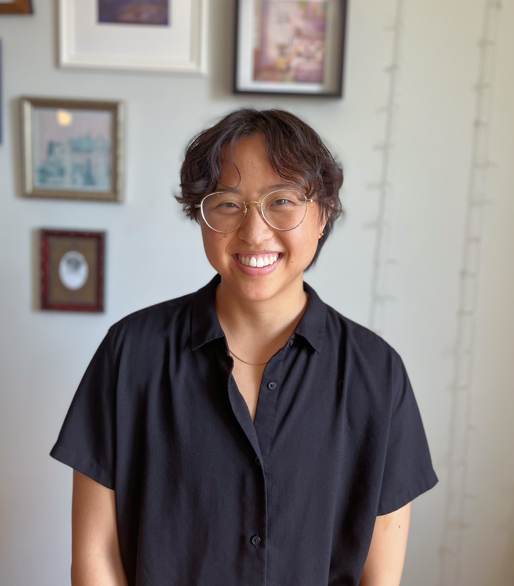

Hi[!](https://lilhuang.github.io/outtake_photos/) My name is Lillian and I am based in Ann Arbor, Michigan. I am many things:

* By education, I am a physicist and computer scientist.
* By trade, I am a data scientist/analyst working in corporate finance.
* By passion, I am an artist interested in all things story.
* By the fundamental nature of my innermost being, I am just a little lump, completely overwhelmed with the intricacies of life. But also I'm excited to be here. Hence: trying to make sense of it through story.

While I like to consume and create stories in all forms (comics, cafe drawings, [storyboards](https://www.lilhuang.github.io/storyboards), stone tablets with ancient runes, etc.), I tend to spend a lot of time [drawing](https://www.instagram.com/itsalilstrange/) and sometimes writing.

Sometimes I do some [other](https://lilhuang.github.io/for_fun/) FIX!!! stuff as well.

