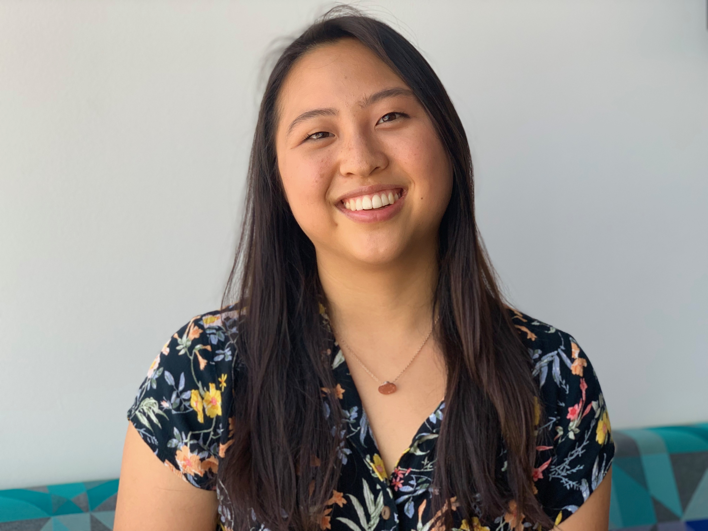

Hi[!](https://lilhuang.github.io/outtake_photos/) I am a fourth-year PhD student at the University of Maryland studying computer vision and graphics. I work with [Max Ehrlich](https://maxehr.umiacs.io/) under advisor [Professor Abhinav Shrivastava](http://abhinavsh.info/). I am currently working on machine learning-guided in-betweening for hand-drawn animation. Before graduate school, I received my B.S. from the University of Michigan in honors physics and computer science.

When I'm not doing grad school stuff, I like to [draw](https://www.instagram.com/itsalilstrange/) and hang out with my [friends](https://lilhuang.github.io/friends/), among [other](lilhuang.github.io/for_fun/) things.

