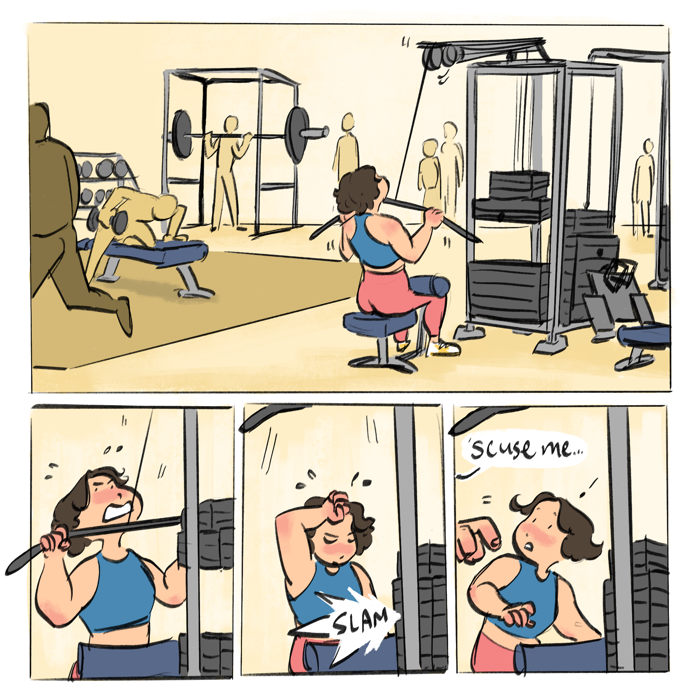
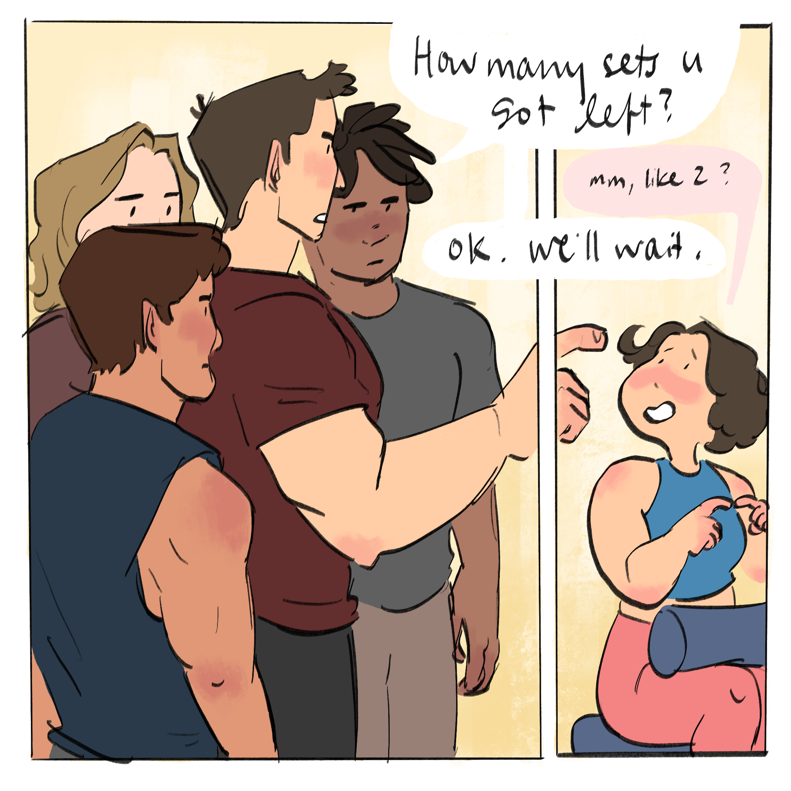
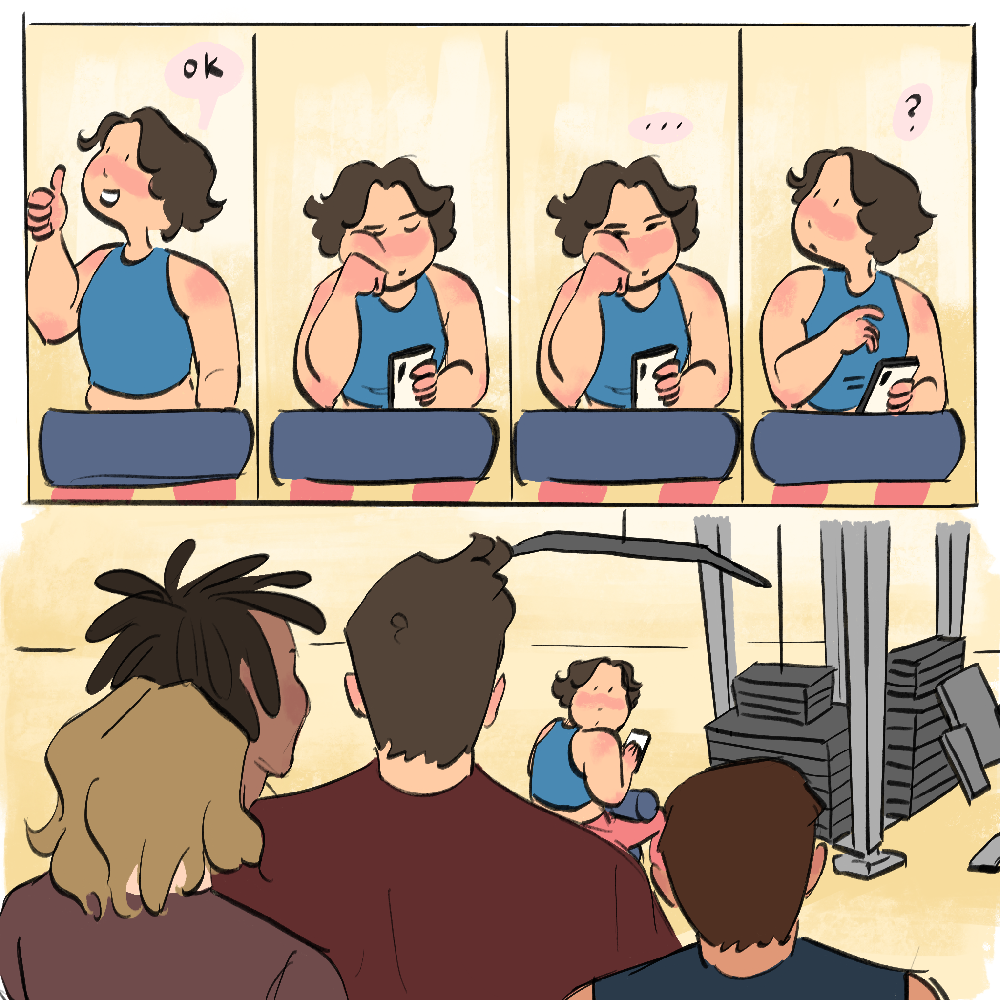
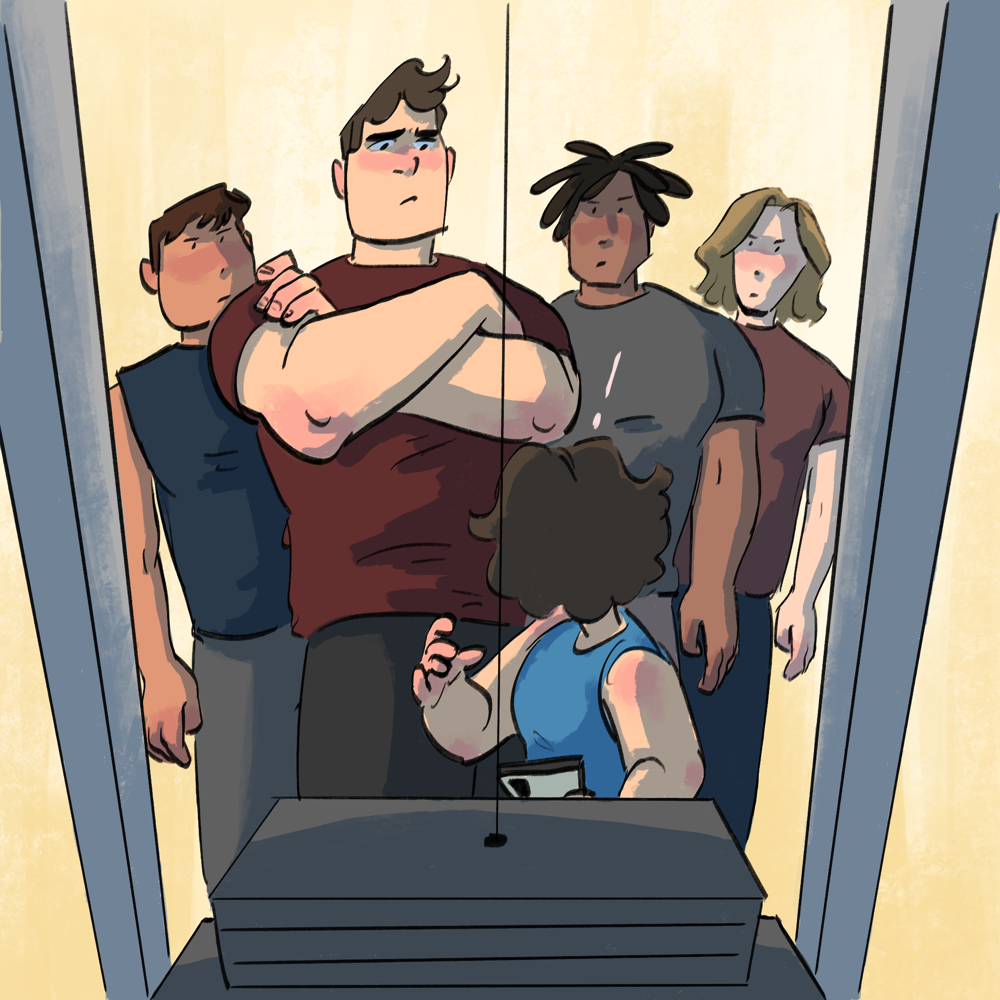
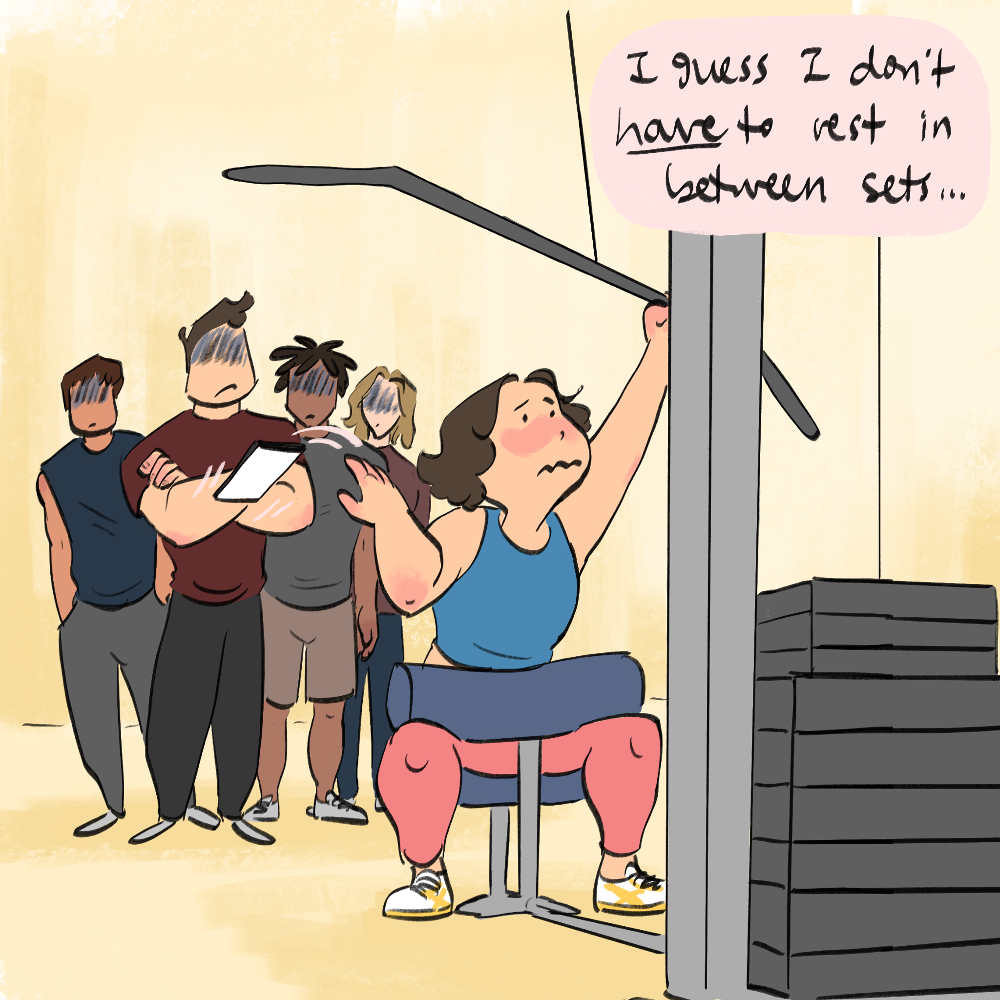

<!-- Thumbnail Gallery -->

  

    
  

  

    
  

  

    
  

  

    
  

  

    
  

<!-- Full-size Image Viewer (initially hidden) -->

  <button class="close-gallery">X</button>
  

    
    
    
    
    
  

  <button class="prev-image">&#10094;</button>
  <button class="next-image">&#10095;</button>

---

