## Holmes and Moriarty | January 2025

A drama sequence (loosely) adapted from Sir Arthur Conan Doyle's *The Final Problem*, depicting Sherlock Holmes's first meeting with his famed nemesis, Professor Moriarty.

This was a personal project from the StoryboardArt Story Mentorship.

<iframe src="https://speakerdeck.com/player/1452122a26a64492855944e36050dde7" style="top: 0; left: 0; width: 100%; height: 100%; position: absolute; border: 0;" allowfullscreen scrolling="no">
</iframe>

A fully-edited animatic can be seen below:

<iframe width="753" height="423" src="https://www.youtube.com/embed/bhL5Gn70Ngg" title="Animatic -- Holmes and Moriarty" frameborder="0" allow="accelerometer; autoplay; clipboard-write; encrypted-media; gyroscope; picture-in-picture; web-share" referrerpolicy="strict-origin-when-cross-origin" allowfullscreen></iframe>

Thumbnails:

<!-- Thumbnail Gallery -->

  

    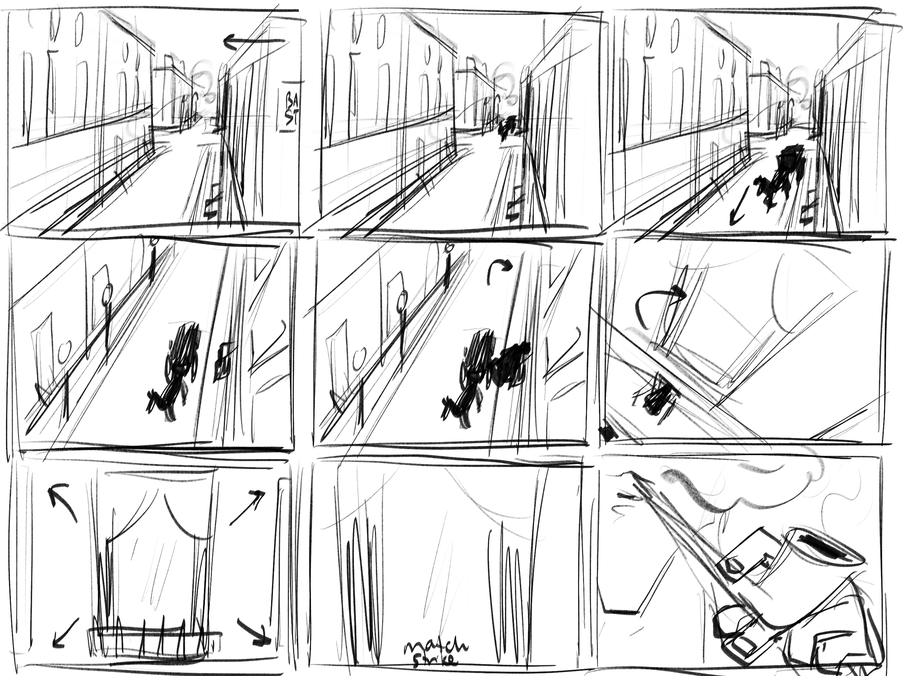
  

  

    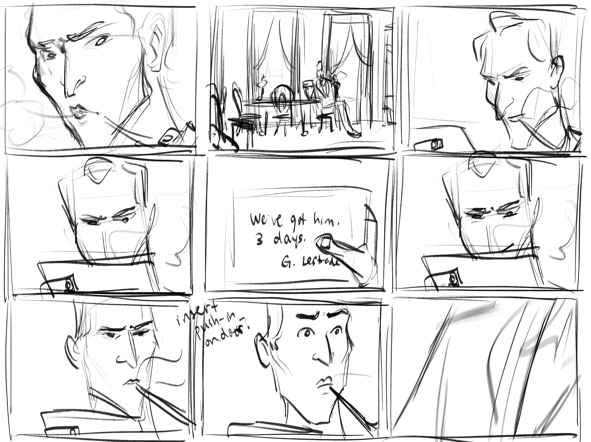
  

  

    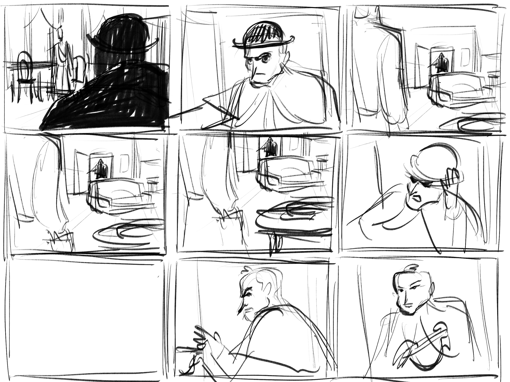
  

  

    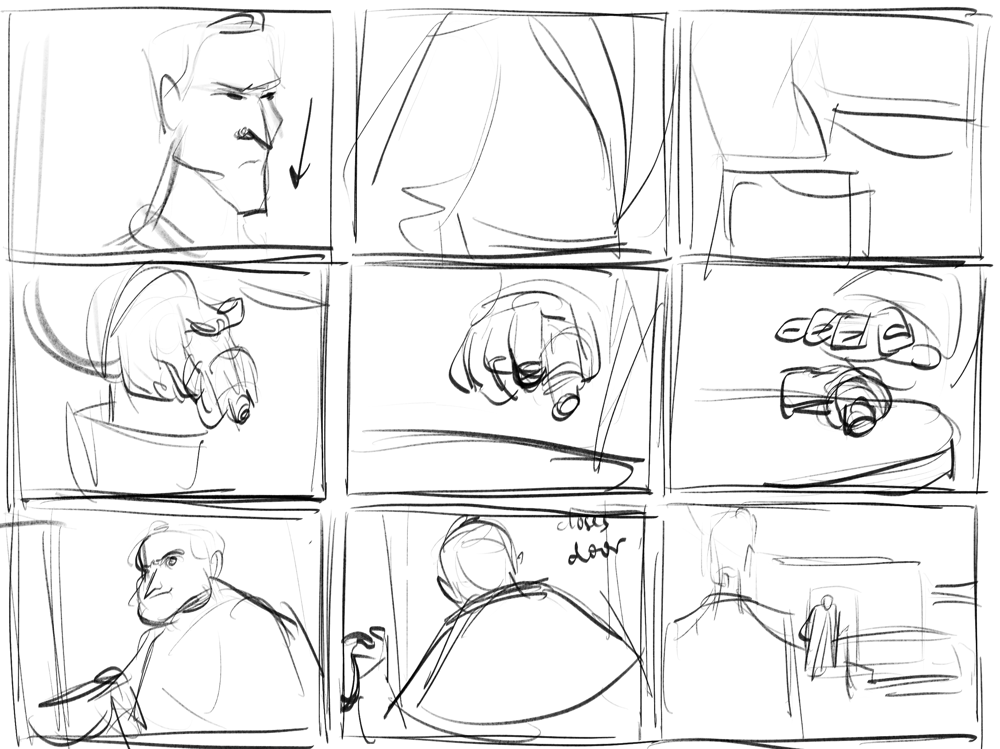
  

  

    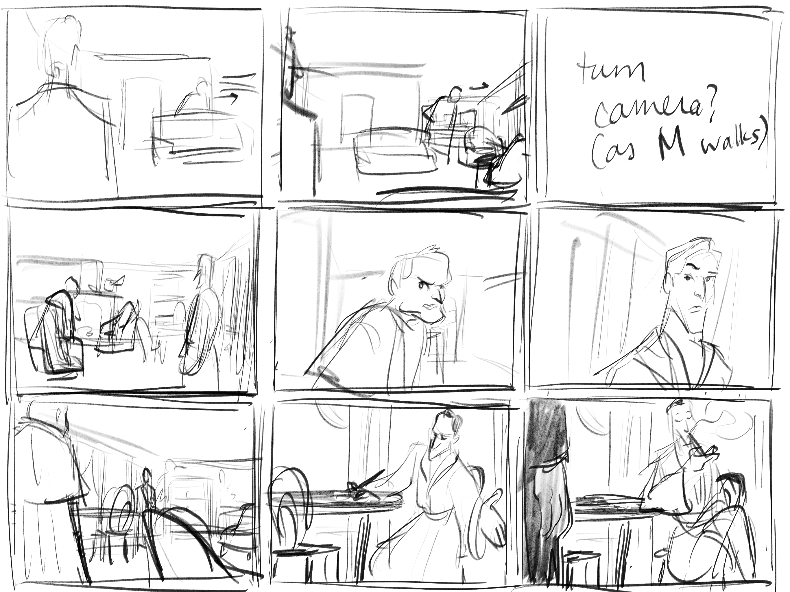
  

  

    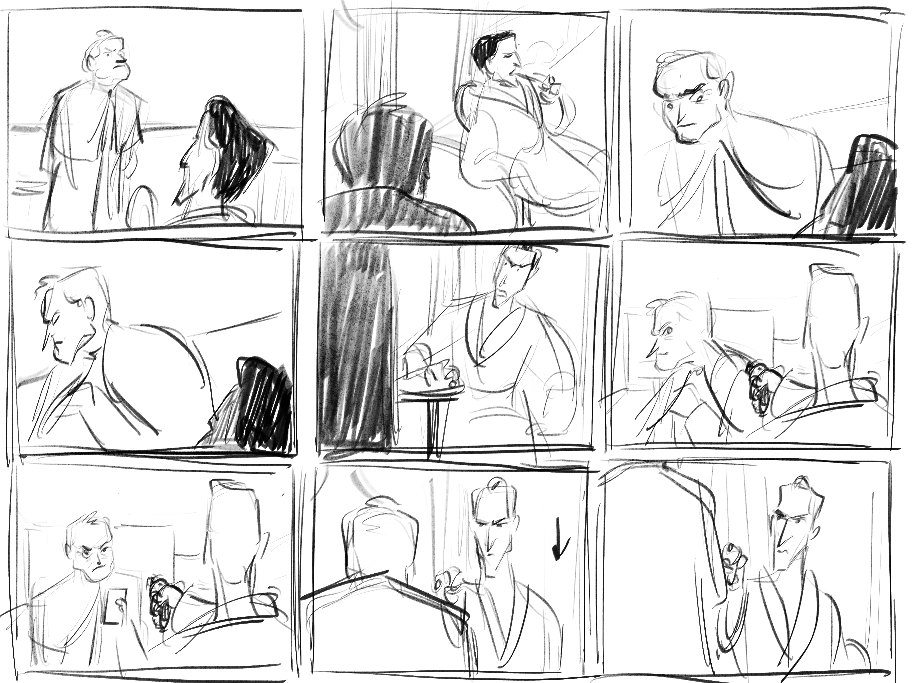
  

  

    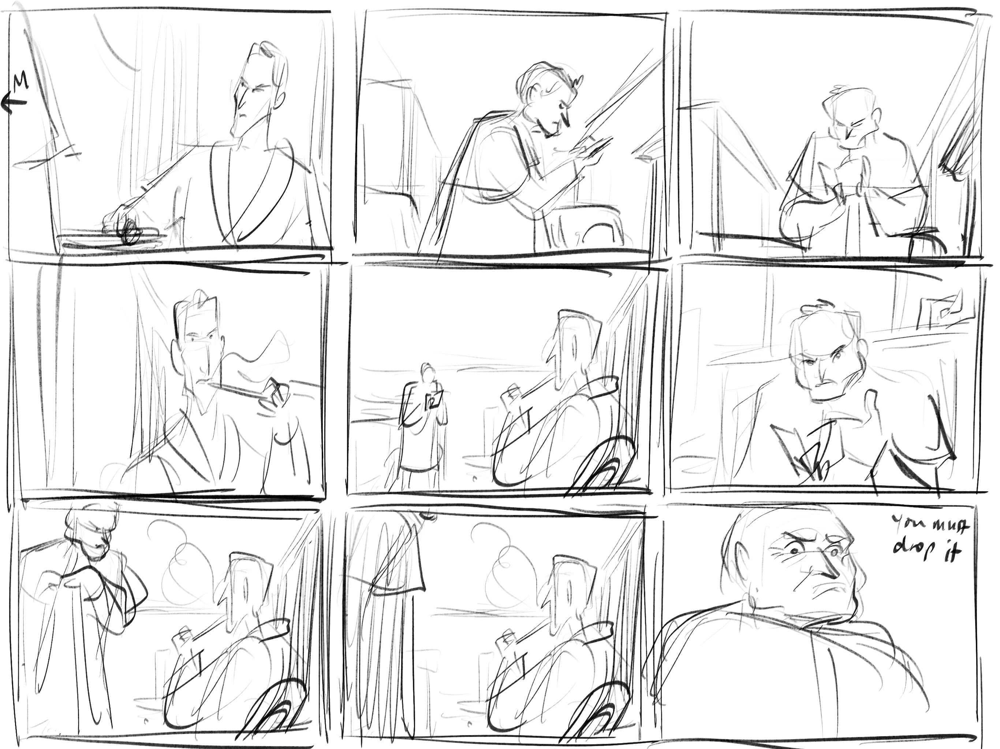
  

  

    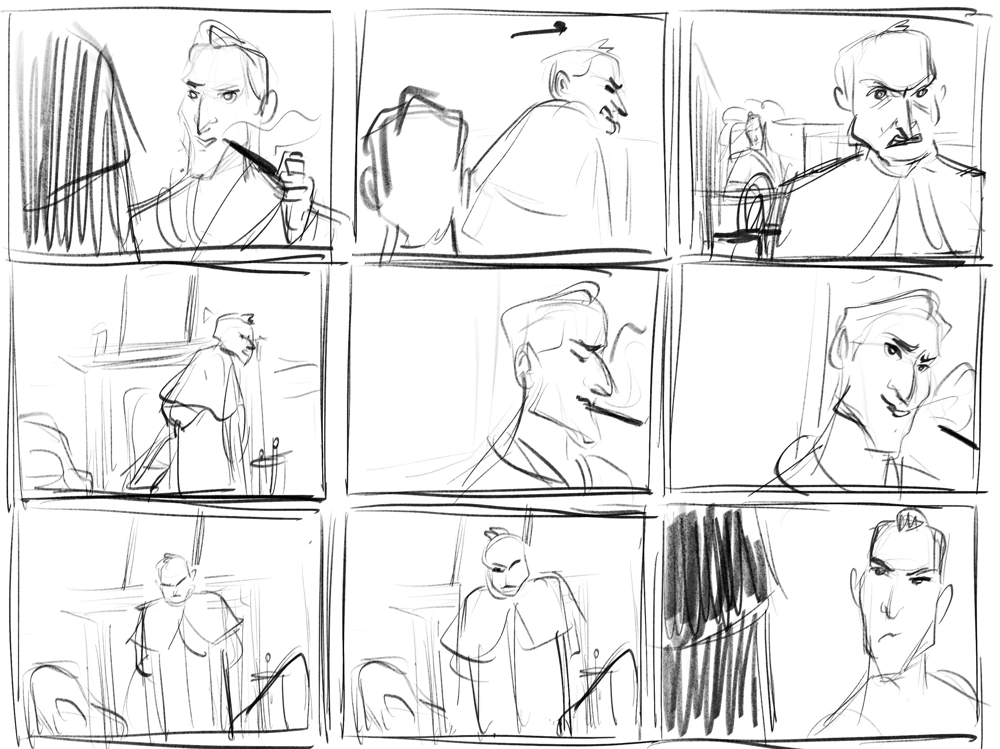
  

  

    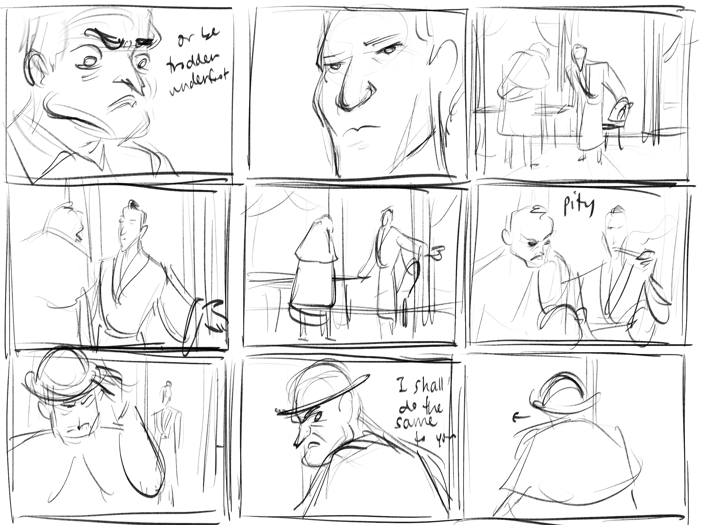
  

  

    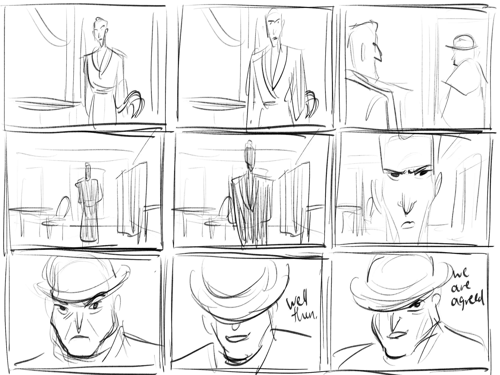
  

  

    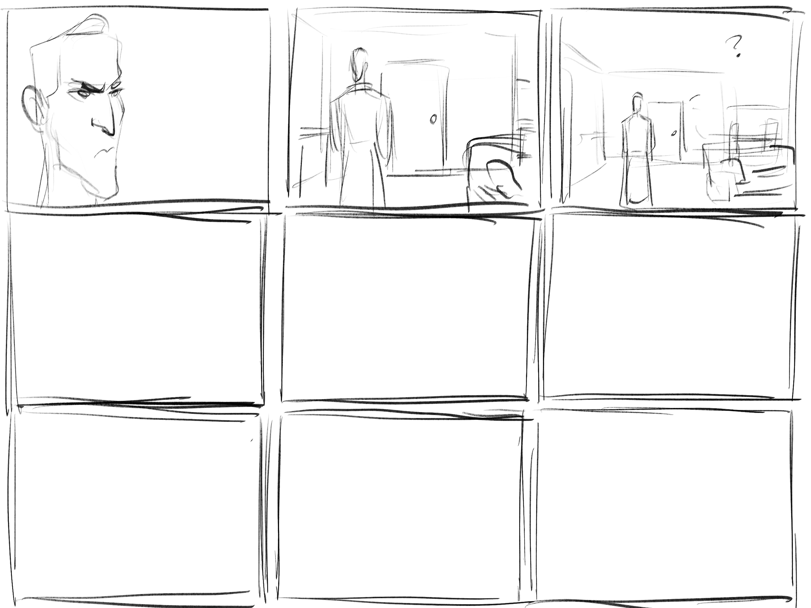
  

<!-- Full-size Image Viewer (initially hidden) -->

  <button class="close-gallery">X</button>
  

    
    
    
    
    
    
    
    
    
    
    
  

  <button class="prev-image">&#10094;</button>
  <button class="next-image">&#10095;</button>

---
## Western Chase | October 2024

An action chase sequence set in the old West, where our two heroes try to lose their pursuers in an abandoned town using only their wits...and a little bit of dynamite.

This was an assignment from the StoryboardArt Story Mentorship, adapted from a scene from *Star Wars Rebels*.

<iframe src="https://speakerdeck.com/player/ed2e24d20fe94e099f2bab9d8ef0bcf9" style="top: 0; left: 0; width: 100%; height: 100%; position: absolute; border: 0;" allowfullscreen scrolling="no">
</iframe>

A fully-edited animatic can be seen below:

<iframe width="753" height="423" src="https://www.youtube.com/embed/yJYkIwIEmak" title="Animatic -- Western Chase" frameborder="0" allow="accelerometer; autoplay; clipboard-write; encrypted-media; gyroscope; picture-in-picture; web-share" referrerpolicy="strict-origin-when-cross-origin" allowfullscreen></iframe>

<!-- Slick JS -->
<!-- 
 -->

